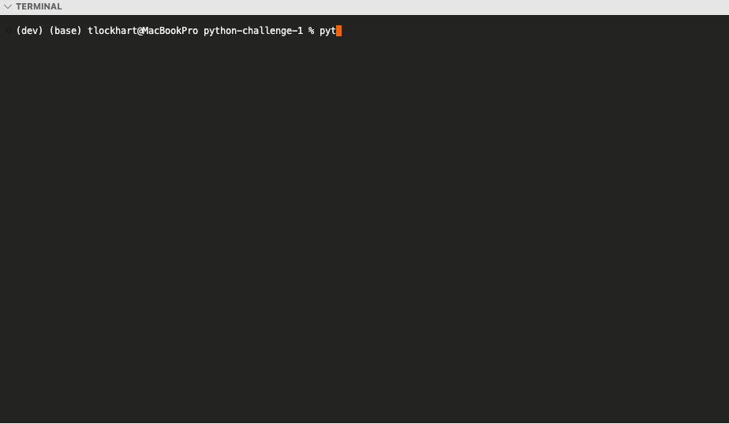

# Food Truck Ordering System - Description
This repository contains a Python script that simulates a food ordering system for a food truck. The menu is categorized into snacks, meals, drinks, and desserts, allowing users to select items and input their desired quantities. The system calculates the total price of the order and provides a receipt, which displays the ordered items.

## Demo
<br/>

The application starts by displaying the menu, prompting users to choose categories and specific items. After choosing the specific item, the user inputs the quantity, and once they have finished ordering, the program prints a receipt of the selected items and the total cost.

## Setup
The main entry point for the app is `menu.py`. To run the application, ensure that Python v3.10 or later is installed on your system and follow the installation steps below.

## Installation Steps
1. Clone this repository to your local machine:
   ```bash
   git clone git@github.com:tlockhart/python-challenge-1.git

## Execute Program
1. Open your terminal, and execute the following commands in the root directory:
    1. python `menu.py` [Enter]
    2. Follow the instructions at the command prompt